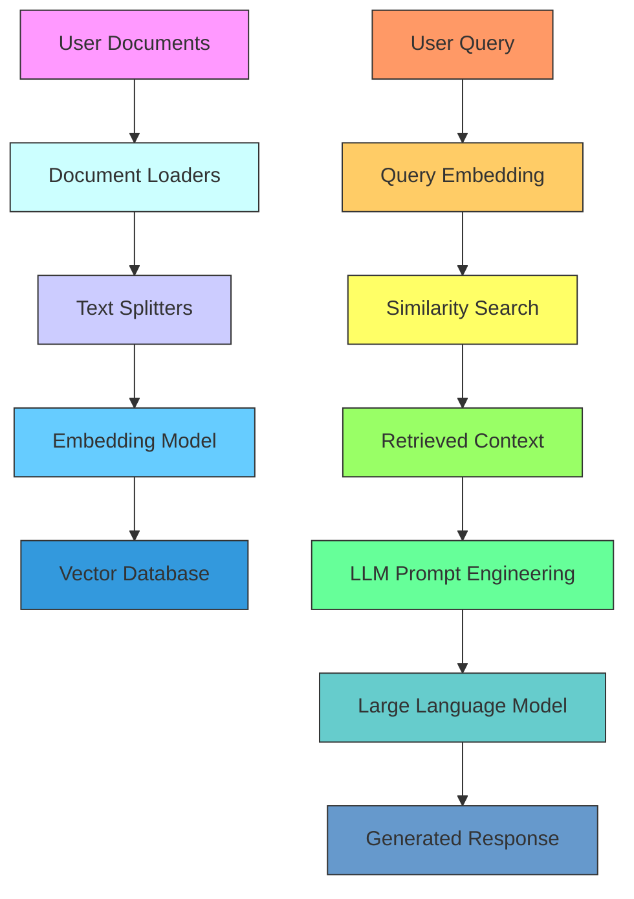

# RAG Architecture Overview

## Architecture Components
1. **Data Ingestion Pipeline**
   - Document Loaders: Nhập dữ liệu từ nhiều nguồn (PDF, web, DB)
   - Text Splitters: Chia văn bản thành các đoạn phù hợp
   - Embedding Model: Chuyển đổi văn bản thành vector

2. **Retrieval System**
   - Vector Database: Lưu trữ embeddings và metadata
   - Similarity Search: Tìm kiếm ngữ nghĩa theo query

3. **Generation Engine**
   - Prompt Engineering: Kết hợp context và query
   - LLM: Tạo phản hồi dựa trên context

## Các điểm lưu ý khi xử lý tiếng nhật và yêu cầu sử dụng các thành phần open-source 
1. Embedding model **multilingual-e5-large**
    - Các tác giả nhật cũng suggest sử dụng model này cho bài toán xử lý tiếng nhật 
    - Kết quả đánh giá cũng cho thấy việc sử lý tiếng nhật và tiếng việt cùng lúc ở mức độ tốt tương đương với ứng dụng notebooklm của google.
    - kết quả tương đối giống với khi sử dụng model embedding của openai là text-embedding-3-large
2. Với **deepseek r1** model cho kết quả suy luận ở mức ngạc nhiên.
    -  với kịch bản phim việc phân tích đặc điểm của nhân vật là khó khăn vì ở nhiều cảnh quay khác nhau nhân vật có thể thay đổi vai trò khác nhau. deepseek r1 model cho kết quả và dẫn chứng thuyết phục.

3. Lưu ý khi chọn tài liệu làm tài liệu test.
    -  trường hợp sử dụng tài liệu ở ngôn ngữ khác và dịch sang tiếng nhật cần đảm bảo việc dịch tương đối sát nghĩa. các danh từ riêng có thể lúc được phiên âm sang katakana hoặc không. một số công cụ dịch hay bị sai
